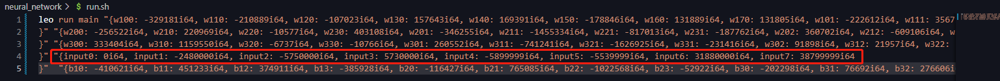

# neural-network-leo

# Introduction
This application is a fully connected neural network price prediction system on the Aleo ecosystem, with the following characteristics:

The Leo contract (neural_network/src/main.leo) implements a 2-layer 4-node neural network(but we also implements a 3-layer 64-node model, due to high deploy fee problem, we decrease the mode size) for predicting token prices.

Unlike existing applications, our system leverages the capabilities of neural networks to analyze historical price data, market trends, and related indicators in real time, providing accurate and reliable price predictions. This innovative approach distinguishes us from traditional technical analysis tools and provides a new perspective for cryptocurrency price prediction.

Given that this model is primarily used for price prediction in the Aleo ecosystem, and the ARC20 token has not yet been perfected, we use ETH price data. For the sake of simplicity in implementation, we did not train on a large amount of data, so the current prediction accuracy is relatively low, about 21%. However, by expanding the network model, increasing the number of layers and nodes, and training on high-quality datasets, we can enhance prediction capabilities.

Our project mainly includes the following:

1. leo_contract_generator.py: A tool produces NN leo source code.
2. main.leo: Our main contracts.
3. run.sh: A tool to run our contract locally.


# How to run
```
  cd neural_network
  ./run.sh
```
  The shell script run.sh is used to run contract in your local machine. 
  If you want to deploy and test it on Testnet, you can refer this link https://developer.aleo.org/testnet/getting_started/deploy_execute_demo. 

## Specify model input
  you can modify the input of model in run.sh 
   

  The input data (val.txt) is located in dataset directory. If you want to test it , you should mulitple raw data by 1000000 and keep 0 decimal to avoid floating point operation which is not supported by Leo. 
  You can choose any line as input,which are 8 numbers. For more details,please refer to the  - [Input-Data-Explanation](#input-data-explanation) section
. Process the chosed input using fixed-point arithmetic and paste it in the red square marked in the image  above. 


## Result analysis
  Due to floating point operation are not supported in Leo, so we use fixed point to work around. The result looks like this 
```
  r0: -216519i64,
  r1: -229010i64,
  r2: -527331i64,
  r3: -441728i64,
  r4: -212522i64,
  r5: -172309i64
```
  we choose the max number in result as predicted label,which is 5 in this situation. we look the lab table 
```
[-1800, -15, -12, 0, 12, 15, 1800] 
   0     1    2   3   4   5   6
```
  label 5 means the predicated next hour ETH price >= current price + 15 .


# Network Model

### Model Structure

In the begining , we design the model of this project as a 2-layer fully connected neural network, and its structure is as follows:

1. Input size: 8
2. Hidden layer 1: 4 neurons, activation function is ReLU
3. Hidden layer 2: 4 neurons, activation function is ReLU
4. Output layer: 6 nodes

#### Input Data Explanation
  The input data are the difference between the current timestamp's price and the last 7 hours before.

#### Output Data Explanation

we pre-process a label table [-1800, -15, -12, 0, 12, 15, 1800]. The rule is that if it falls in the interval of this array, the left endpoint of the interval is used as the output label which means  price difference between the next hour's price and the current price.
